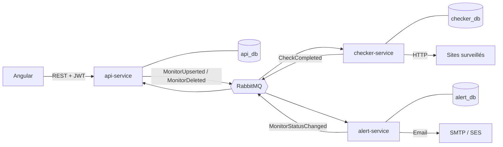

# Architecture

## 1. Le projet en bref

Sentinel permet à un utilisateur d'enregistrer des sites web à surveiller. Le système les vérifie périodiquement, mesure leur disponibilité et leur temps de réponse, et envoie un email dès qu'un site tombe ou revient.

**Objectifs**

- Démontrer une architecture événementielle réaliste : microservices, une base par service, RabbitMQ, pattern Outbox.
- Couvrir toute la chaîne d'un projet professionnel : code, tests, Docker, CI/CD, Kubernetes, Helm, Terraform, cloud, observabilité.
- Se démontrer facilement : un produit compris en 10 secondes, qui se monitore lui-même.

## 2. Vue d'ensemble



## 3. Rôle de chaque service

| Service | Responsabilité | Base | Tables |
|---|---|---|---|
| **api-service** | API REST pour Angular, authentification, CRUD moniteurs, calcul des métriques | `api_db` | `user`, `monitor`, `check_result`, `incident`, `outbox_event` |
| **checker-service** | Planifie et exécute les vérifications HTTP. Stateless, scalable horizontalement | `checker_db` | `monitor_to_check` (+ `outbox_event` si besoin) |
| **alert-service** | Seul décideur de l'état d'un moniteur. Compte les échecs, ouvre et ferme les incidents, envoie les emails | `alert_db` | `monitor_state`, `incident`, `processed_check`, `outbox_event` |

**Principe clé : chaque service possède ses données et personne d'autre n'y touche.** Les services ne communiquent que par événements, à l'exception d'un endpoint interne de resynchronisation (voir [pitfalls.md](pitfalls.md)).

### Hébergement des bases

- **Local** : un seul conteneur PostgreSQL, trois bases (`api_db`, `checker_db`, `alert_db`), trois utilisateurs distincts. Chaque utilisateur n'a accès qu'à sa base.
- **GCP** : une seule instance Cloud SQL, trois bases, pour limiter les coûts.

### Qui décide de quoi

- `status` et `consecutive_failures` appartiennent à l'**alert-service**.
- L'api-service garde une **copie** du statut (`status_copy`) pour l'affichage, mise à jour par `MonitorStatusChanged`.
- L'api-service reconstruit l'historique des incidents depuis `MonitorStatusChanged`.
- L'alert-service connaît l'email du propriétaire grâce à `MonitorUpserted` (*event-carried state transfer*), sans jamais appeler l'api-service.

## 4. Stack technique

| Domaine | Choix |
|---|---|
| Backend | Java 21, Spring Boot 3 (Web, Data JPA, Security, AMQP, Actuator), Flyway |
| Messagerie | RabbitMQ (retries + dead-letter queues) |
| Base de données | PostgreSQL |
| Frontend | Angular (standalone components), ngx-charts ou Chart.js |
| Tests | JUnit 5, Testcontainers (PostgreSQL + RabbitMQ), k6 (charge) |
| Conteneurs | Dockerfile multi-stage par service, docker-compose en local, Mailpit pour les emails |
| Orchestration | Kubernetes (kind en local, GKE ensuite), Helm (chart parent) |
| Infra as code | Terraform (GKE, Cloud SQL, réseau) ; Ansible en bonus |
| Cloud | GCP en principal ; AWS SES pour les emails (dimension multi-cloud) |
| CI/CD | GitHub Actions : build, tests, scan d'image (Trivy), push, déploiement |
| Observabilité | Micrometer, Prometheus, Grafana, logs JSON structurés |

### Usage de Kubernetes

Deployments, Services, Ingress, ConfigMaps et Secrets, probes liveness/readiness, HPA sur le checker, CronJob de purge des résultats, NetworkPolicy pour isoler `/internal/**`.

## 5. Structure du repo

```
sentinel/
├── services/
│   ├── api-service/
│   ├── checker-service/
│   └── alert-service/
├── frontend/                # Angular
├── deploy/
│   ├── docker-compose.yml
│   ├── helm/sentinel/
│   └── terraform/
├── docs/                    # ce dossier
│   └── adr/
├── .github/workflows/
└── README.md
```

## 6. Contenu du README racine (à produire en fin de projet)

- Pitch en deux phrases et GIF de démo
- Schéma d'architecture et diagramme de séquence
- Choix assumés (une base par service, Outbox, compromis du démarrage à froid)
- `docker compose up` qui fonctionne en une commande
- Résultats du test de charge et capture Grafana
- Limites connues et pistes d'évolution
