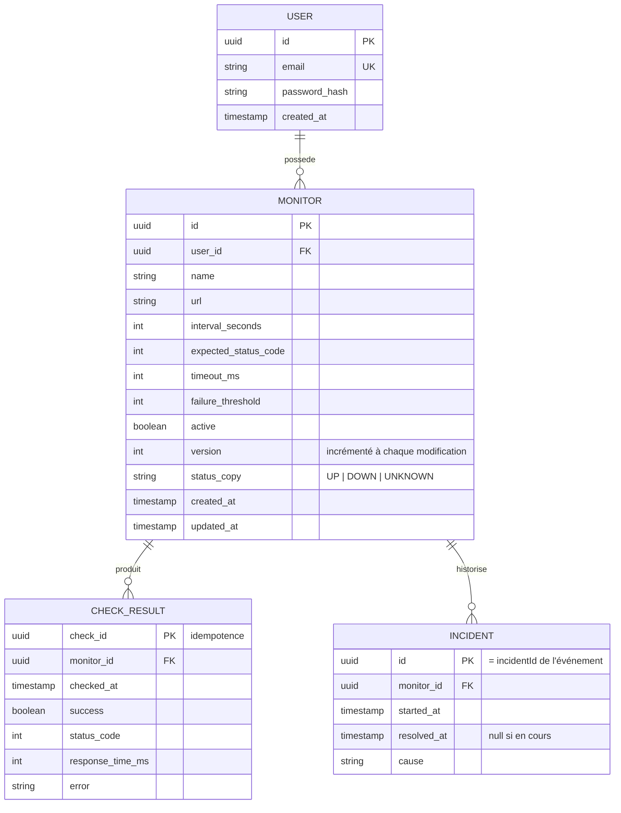
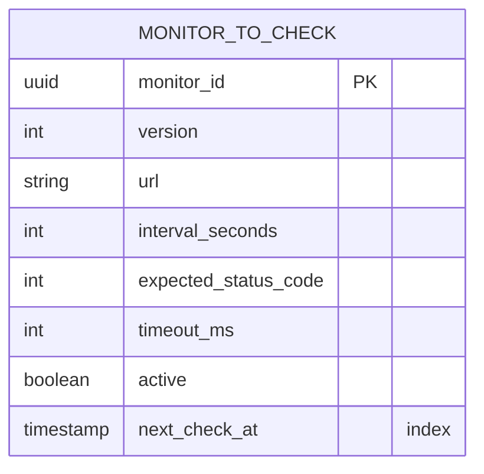
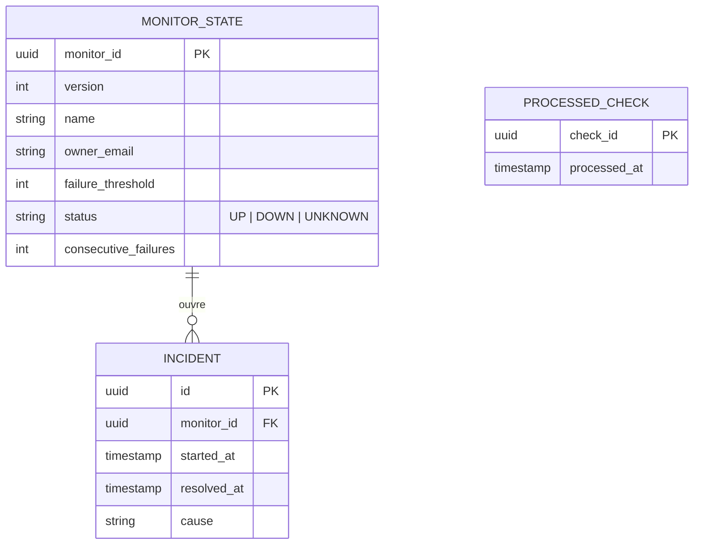

# Modèle de données

Chaque service possède sa base. Les schémas sont versionnés avec **Flyway** (`src/main/resources/db/migration`).

## api_db

La table `outbox_event` est technique et omise du diagramme :

| Colonne | Type | Rôle |
|---|---|---|
| `id` | uuid | Identifiant de l'événement |
| `routing_key` | text | Ex. `monitor.upserted` |
| `payload` | jsonb | Enveloppe complète |
| `created_at` | timestamp | Ordre de publication |
| `published_at` | timestamp | Nul tant que non publié |

## checker_db

## alert_db

## Points de conception

- **`CHECK_RESULT` est la table qui grossit** : 1 moniteur à 1 min = 1 440 lignes par jour. Index sur `(monitor_id, checked_at)`, purge à 30 jours. Évolution possible : partitionnement par date.
- **Un seul incident ouvert par moniteur** : index unique partiel `CREATE UNIQUE INDEX ... ON incident (monitor_id) WHERE resolved_at IS NULL`.
- **Idempotence** : `check_id` en clé primaire (api_db) et table `processed_check` (alert_db) permettent d'ignorer les doublons.
- **Versions** : `version` est comparée à l'arrivée d'un `MonitorUpserted` ; un événement de version inférieure ou égale est ignoré.
- **Index de planification (checker)** : `CREATE INDEX ON monitor_to_check (next_check_at) WHERE active`.
- **Purge d'`outbox_event`** : suppression des lignes publiées depuis plus de 7 jours.
- **Suppression de compte** : `ON DELETE CASCADE` sur `monitor`, `check_result` et `incident`, et un `MonitorDeleted` publié par moniteur.
