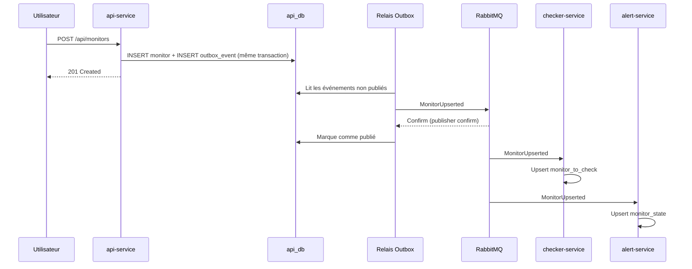
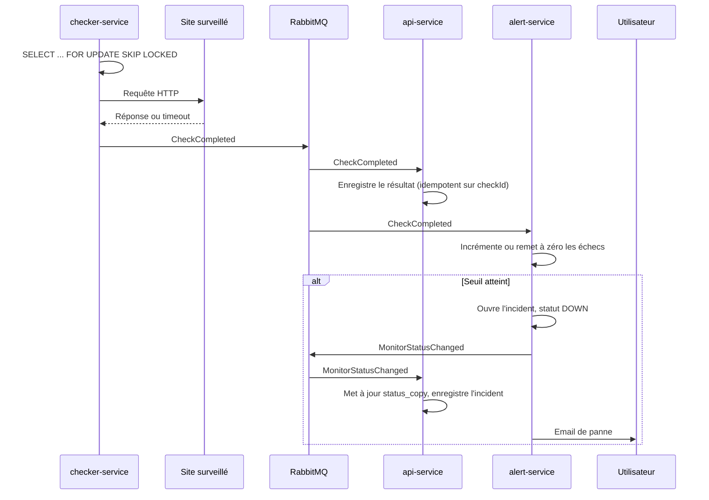
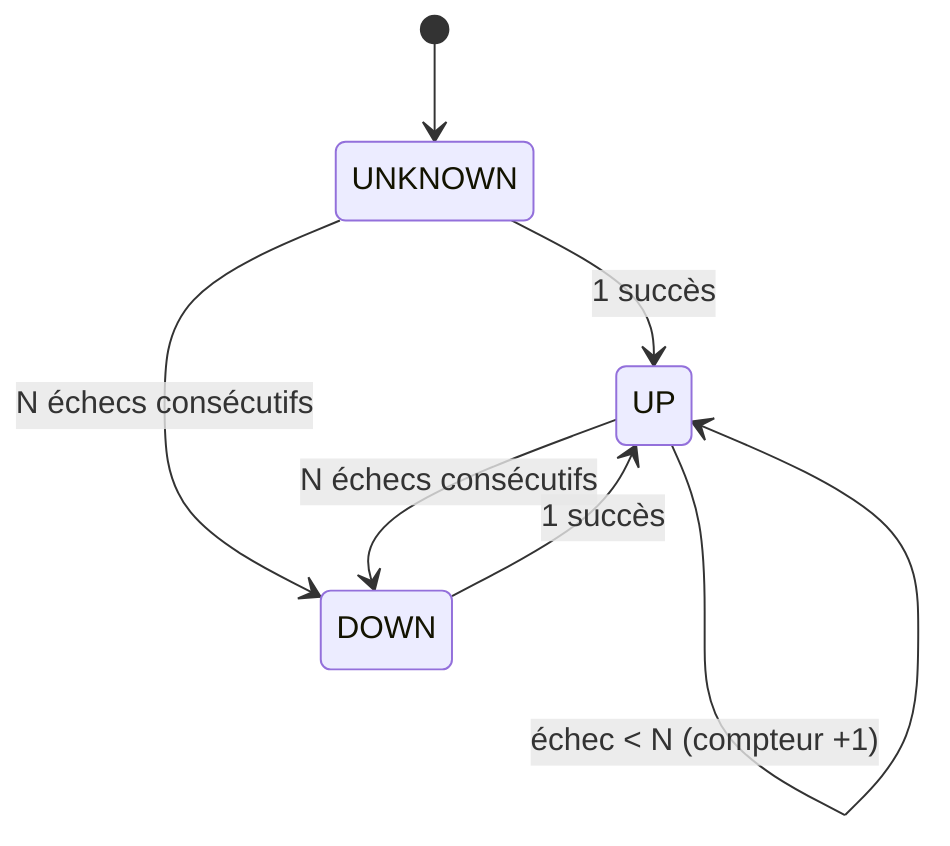
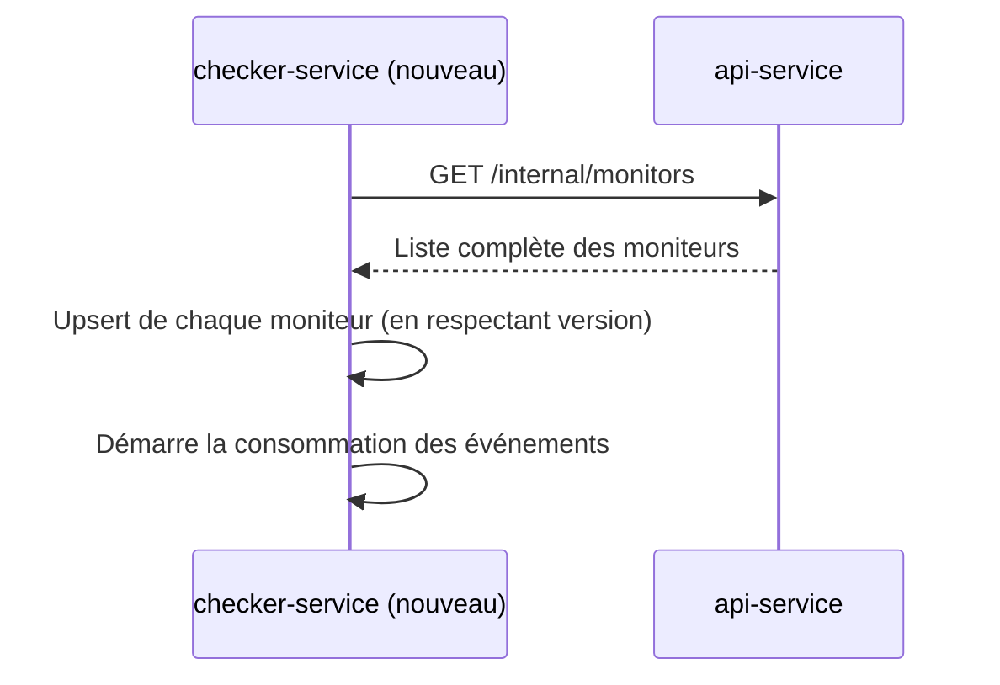
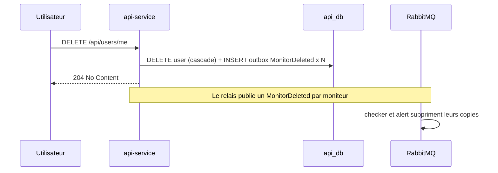

# Flux principaux

## 1. Création d'un moniteur



## 2. Vérification et alerte



## 3. Machine à états d'un moniteur (alert-service)



Un moniteur en pause (`active = false`) ne produit plus de vérifications ; son état est conservé.

## 4. Scheduling sans doublons (checker-service)

Chaque instance exécute périodiquement :

```sql
SELECT * FROM monitor_to_check
WHERE active AND next_check_at <= now()
ORDER BY next_check_at
LIMIT 50
FOR UPDATE SKIP LOCKED;
```

Les lignes verrouillées par une instance sont ignorées par les autres : chaque instance traite un lot différent. Après vérification, `next_check_at` est repoussé de `interval_seconds`.

## 5. Démarrage à froid du checker



Appelé uniquement quand `checker_db` est vide. L'endpoint n'est pas exposé par l'Ingress.

## 6. Suppression de compte


