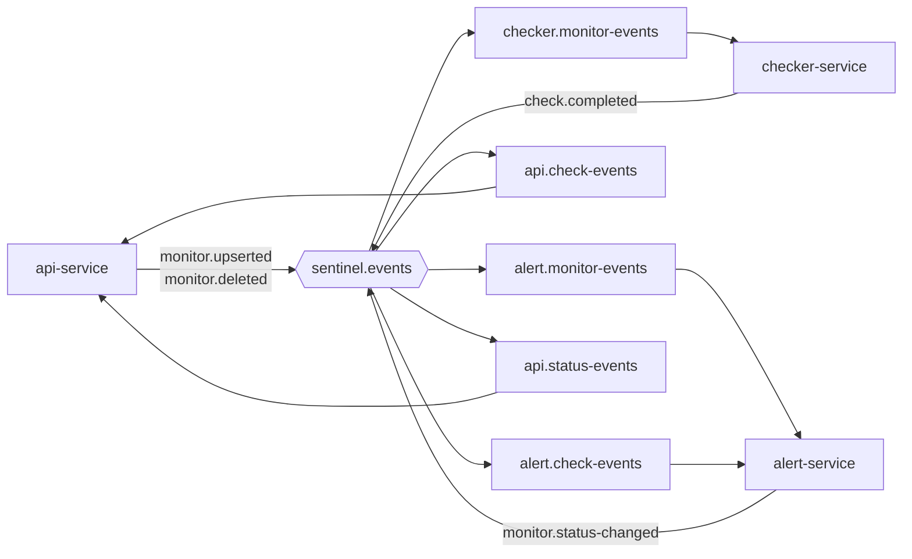

# Messagerie : RabbitMQ

## Concepts

| Terme | Rôle |
|---|---|
| **Producer** | Envoie un message |
| **Exchange** | Reçoit les messages et décide dans quelles queues les copier |
| **Binding** | Règle « les messages de telle routing key vont dans telle queue » |
| **Queue** | File qui stocke les messages jusqu'à leur consommation |
| **Consumer** | Lit et traite les messages d'une queue |
| **Ack / Nack** | Accusé de réception positif / négatif du consumer |
| **DLQ** | Dead-letter queue : quarantaine des messages en échec définitif |

Un producteur n'envoie **jamais** directement dans une queue : il publie sur un exchange avec une routing key.

Deux queues distinctes reçoivent chacune **une copie** d'un message. Plusieurs consumers sur **une même queue** se **partagent** les messages (competing consumers).

## Topologie

Un exchange `topic` : **`sentinel.events`**. Une queue par service consommateur et par famille d'événements. **Bindings explicites** (pas de jokers : `monitor.*` capterait `monitor.status-changed`).

| Routing key | Producteur | Queue | Consommateur |
|---|---|---|---|
| `monitor.upserted` | api | `checker.monitor-events` | checker |
| `monitor.deleted` | api | `checker.monitor-events` | checker |
| `monitor.upserted` | api | `alert.monitor-events` | alert |
| `monitor.deleted` | api | `alert.monitor-events` | alert |
| `check.completed` | checker | `api.check-events` | api |
| `check.completed` | checker | `alert.check-events` | alert |
| `monitor.status-changed` | alert | `api.status-events` | api |

Chaque queue a sa DLQ : `<queue>.dlq`.



## Fiabilité

- Queues **durables**, messages **persistants** (défaut de Spring AMQP).
- **Publisher confirms** activés : le relais Outbox ne marque un événement publié qu'après confirmation du broker.
- **Acquittement manuel ou après succès** : un message n'est supprimé qu'après traitement réussi.
- **Prefetch** modéré (10 à 20) pour répartir équitablement entre instances.
- **Retry avec backoff exponentiel** (3 tentatives), puis envoi en DLQ.
- **Sérialisation JSON** (`Jackson2JsonMessageConverter`), jamais la sérialisation Java.
- Livraison **au moins une fois** : les consumers sont idempotents (voir [events.md](events.md)).

## Configuration Spring (indicative)

```yaml
spring:
  rabbitmq:
    host: ${RABBITMQ_HOST:localhost}
    port: 5672
    username: ${RABBITMQ_USER:guest}
    password: ${RABBITMQ_PASSWORD:guest}
    publisher-confirm-type: correlated
    publisher-returns: true
    listener:
      simple:
        prefetch: 10
        retry:
          enabled: true
          max-attempts: 3
          initial-interval: 1000
          multiplier: 2.0
          max-interval: 10000
        default-requeue-rejected: false   # après les retries, le message part en DLQ
```

## Outils

L'interface de gestion est sur `http://localhost:15672` (image `rabbitmq:3-management`). On y voit exchanges, queues, bindings, nombre de messages, et on peut publier ou lire un message à la main.
